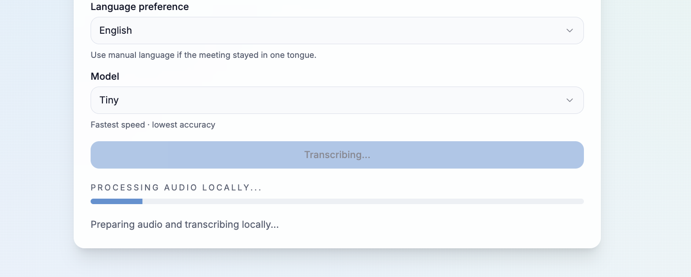
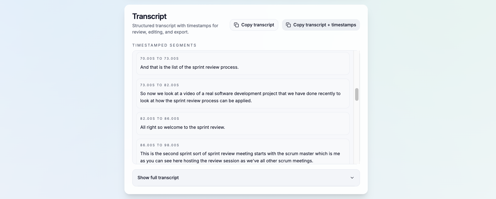
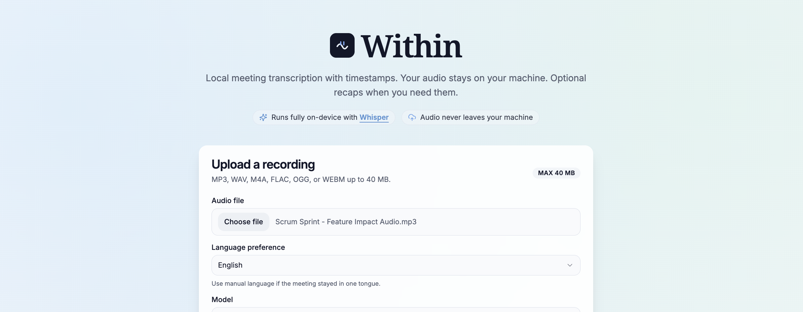
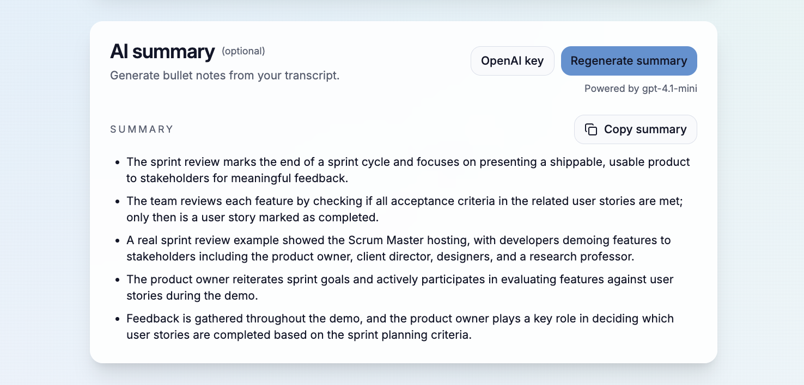

# Within

Private meeting transcription with timestamps. Your audio stays on your machine, with optional recaps when you need them.

## Features

- Runs Whisper locally: audio never leaves your machine.
- Upload any supported audio and track progress with in-app status.
- Structured transcript with timestamps and quick copy actions.
- Optional AI summary (OpenAI key) to generate bullet notes.





**Transcript**



**AI summary**



## Requirements

- Python 3.10+
- Node.js 18+
- `ffmpeg` installed and on your PATH (see setup below)
- First run needs internet to download Whisper weights

## Install ffmpeg (required)

Whisper depends on `ffmpeg` for audio decoding. Install it once:

macOS (Homebrew):
```bash
brew install ffmpeg
```

Ubuntu/Debian:
```bash
sudo apt update
sudo apt install ffmpeg
```

Windows (PowerShell):
```powershell
winget install Gyan.FFmpeg
```

Verify:
```bash
ffmpeg -version
```

## Quick Start (two terminals)

Backend (Flask + Whisper):

```bash
python3 -m venv .venv
source .venv/bin/activate  # Windows: .venv\Scripts\activate
pip install -r requirements.txt

# Optional overrides
export WHISPER_MODEL=medium   # default: large-v3
export WHISPER_LANGUAGE=auto  # default: auto
export PORT=5050              # default: 5050

python app.py
```

Frontend (Vite):

```bash
npm install
npm run dev
```

Open `http://localhost:5173`.

The dev server proxies `/config`, `/transcribe`, and `/summarize` to `http://localhost:5050`. If your backend runs elsewhere, set:

```bash
export VITE_BACKEND_URL=http://localhost:5050
```

## Troubleshooting

- `No such file or directory: 'ffmpeg'` means ffmpeg is missing or not on your PATH. Install it using the steps above and restart your terminal.

## Environment Variables (backend)

| Variable | Purpose | Default |
| --- | --- | --- |
| `PORT` | Flask port | `5050` |
| `WHISPER_MODEL` | Default checkpoint | `medium` or recommended |
| `WHISPER_MODELS` | Comma-separated allowlist | `tiny,base,small,medium,large-v2,large-v3` |
| `WHISPER_RECOMMENDED_MODEL` | Highlighted model in UI | `medium` |
| `WHISPER_LANGUAGE` | Default language hint | `auto` |
| `MAX_UPLOAD_MB` | Upload limit in MB | `40` |
| `OPENAI_API_KEY` | Server-side summary key | unset |
| `OPENAI_SUMMARY_MODEL` | Summary model | `gpt-4.1-mini` |
| `OPENAI_API_BASE` | Custom OpenAI-compatible endpoint | `https://api.openai.com/v1` |

## Notes

- Audio never leaves your machine. Whisper runs locally.
- Summary requests only send transcript text plus a language hint.
- Temp files are deleted after transcription completes.
